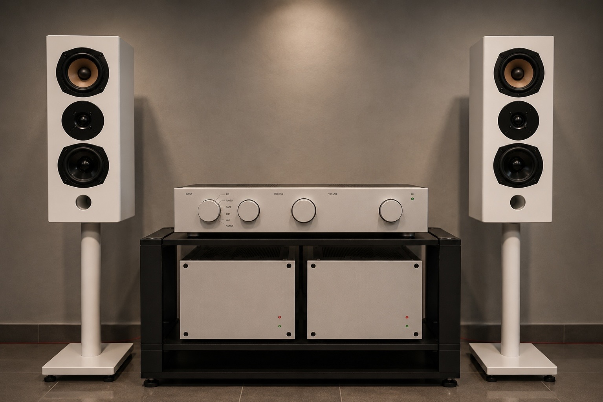
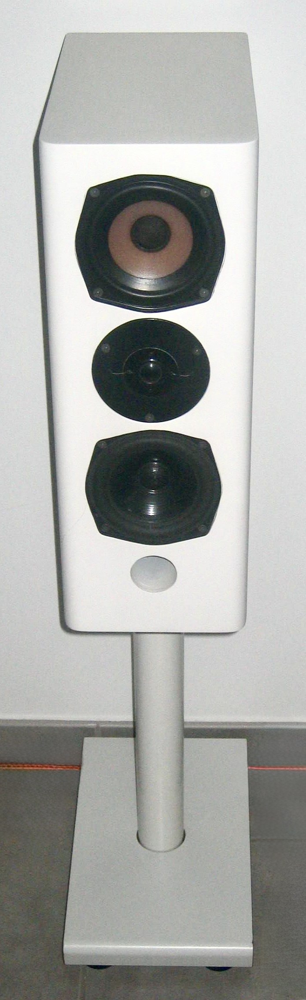
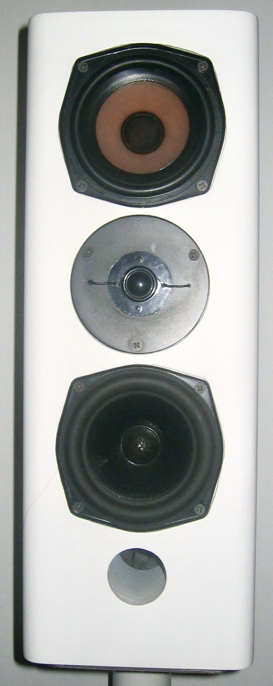

# RTAL CHAD-003
# High-End Audio Loudspeakers

> **Realtime Audio Lab – Engineering Heritage Archive**

---

# A Handmade Reference Loudspeaker

The **RTAL CHAD-003** is a handcrafted loudspeaker system designed and built as the acoustic counterpart to the **RTAL Reference One Preamplifier** and the **RTAL Reference Power Amplifiers**.

Rather than pursuing spectacular measurements or commercial trends, the objective was simple:

> **Build a compact loudspeaker that reproduces music naturally, disappears acoustically, and integrates beautifully into a modern living room.**

---

# Design Highlights

- 🎵 Handcrafted loudspeaker and stand
- 📐 Cabinet proportions based on the Golden Ratio
- 🔊 KEF T27 + KEF B110 + Harbeth-treated KEF B110
- 🎚 Original KEF crossover components
- 🔬 Numerous listening and crossover optimization cycles
- 🏡 Designed specifically for elegant living-room integration
- ❤️ Developed as part of the RTAL Reference Audio System

---

# Gallery

## Complete Reference Audio System

## CHAD-003 Loudspeaker

## Driver Close-up

  
---

# Engineering Story

The CHAD-003 project originated from the desire to build a complete reference audio system entirely in-house.

After developing the RTAL electronics, commercially available loudspeakers never achieved the exact presentation envisioned for the system.

Instead of adapting the electronics to existing loudspeakers, the loudspeakers were developed specifically to complement the electronics.

The result is a coherent system in which every component was voiced together.

---

# Design Philosophy

Good loudspeakers should not attract attention to themselves.

They should simply reproduce music with honesty, precision and emotion.

The CHAD-003 was therefore optimized over many listening sessions rather than being designed purely around simulations.

Every modification was evaluated by listening until the loudspeakers disappeared acoustically and only the music remained.

---

# Cabinet Design

The cabinet and matching stands were designed and manufactured completely by hand.

## Features

- Bass reflex enclosure
- Golden Ratio proportions
- Multiple cabinet optimization stages
- Handmade MDF construction
- Handmade loudspeaker stand
- Satin white finish

The enclosure dimensions are currently being reconstructed from the original loudspeakers and will be published in a future update.

---

# Driver Configuration

| Position | Driver |
|-----------|--------|
| Tweeter | KEF T27 |
| Midrange | KEF B110 (Harbeth-treated Bextrene) |
| Woofer | KEF B110 |

The combination was selected after extensive comparisons and listening tests.

---

# Crossover Development

The crossover was never considered a finished design.

Instead it evolved through numerous iterations.

Features include:

- Original KEF crossover components
- Hand-optimized values
- Voiced specifically for this driver combination
- Tuned entirely by measurement and listening

The original schematic is unfortunately no longer available and will be reverse engineered from the preserved hardware.

---

# Listening Experience

The loudspeakers deliver:

- exceptionally natural vocals
- precise imaging
- stable soundstage
- excellent depth
- effortless musicality
- fatigue-free listening

Perhaps the greatest compliment came from visitors.

Despite the relatively small KEF drivers, listeners frequently walked behind the loudspeakers because they assumed an additional hidden woofer or subwoofer must be operating.

There wasn't.

Everything originated from the CHAD-003 itself.

---

# System Matching

The loudspeakers were designed exclusively for use with

- RTAL Reference One Preamplifier
- RTAL Reference Power Amplifiers

Together they form a complete RTAL Reference playback chain.

---

# Roadmap

Future additions planned:

- Cabinet drawings
- Internal photographs
- Reconstructed crossover schematic
- Component list
- Measurement results
- Historical development notes

---

# Engineering Heritage

This repository forms part of the **Realtime Audio Lab Engineering Heritage Archive**.

The purpose is to preserve over four decades of engineering knowledge, experimentation and craftsmanship for future generations of audio enthusiasts.

---

## License

Educational and historical documentation.

© Realtime Audio Lab

